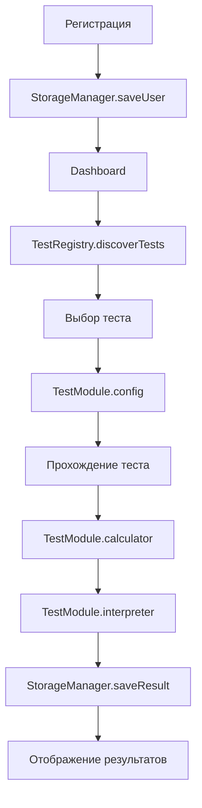

# 🧠 PSY-TESTS - Система Психологических Тестов

Профессиональная Vue 3 система для проведения адаптивных психологических тестов с персонализированными результатами и рекомендациями.

[](https://vuejs.org/)
[](https://pinia.vuejs.org/)
[](https://vitejs.dev/)
[]()

## 🚀 Быстрый старт

```bash
# Установка зависимостей
npm install

# Запуск в режиме разработки
npm run dev

# Сборка для продакшена
npm run build
```

## 📁 Новая масштабируемая архитектура

```
PSY-TESTS/
├── 📁 public/
│   └── favicon.ico
├── 📁 src/
│   ├── 📁 components/          # Vue компоненты
│   │   ├── SingleChoice.vue    # Компонент одиночного выбора
│   │   ├── MultipleChoice.vue  # Компонент множественного выбора
│   │   └── ScaleQuestion.vue   # Компонент шкалы оценки
│   ├── 📁 composables/         # Composition API логика
│   │   ├── useTestLogic.js     # 🔄 Основная логика (обновлено)
│   │   └── useDemographics.js  # Демографическая обработка
│   ├── 📁 core/                # 🆕 ЯДРО СИСТЕМЫ
│   │   ├── test-engine/        # Движок тестов
│   │   │   └── TestRegistry.js # Автоматическая регистрация тестов
│   │   └── storage/            # Система хранения
│   │       └── StorageManager.js # Адаптеры хранения данных
│   ├── 📁 tests/               # 🆕 МОДУЛЬНЫЕ ТЕСТЫ
│   │   └── stress-burnout/     # Каждый тест - отдельная папка
│   │       ├── config.js       # Структура вопросов
│   │       ├── calculator.js   # Логика расчетов
│   │       ├── interpreter.js  # Интерпретация результатов
│   │       └── index.js        # Связывание компонентов
│   ├── 📁 data/                # ⚠️ LEGACY (будет удалено)
│   │   └── stressTest.js       # Старая структура теста
│   ├── 📁 pages/               # Страницы приложения
│   │   ├── RegistrationPage.vue # Регистрация пользователей
│   │   ├── DashboardPage.vue   # Главная панель
│   │   ├── TestPage.vue        # Страница прохождения тестов
│   │   └── ResultPage.vue      # Результаты тестов
│   ├── 📁 router/              # Vue Router конфигурация
│   │   └── index.js
│   ├── 📁 stores/              # Pinia хранилища (обновлены)
│   │   ├── userStore.js        # 🔄 Управление пользователями
│   │   └── testStore.js        # 🔄 Управление тестами
│   ├── 📁 utils/               # Утилиты
│   │   └── testUtils.js        # ⚠️ LEGACY утилиты для тестов
│   ├── App.vue                 # Корневой компонент
│   └── main.js                 # Точка входа
├── README.md
├── AI-CONTEXT.md               # 🆕 Контекст для ИИ
├── SERVER-DATA-PLAN.md         # 🆕 План серверной архитектуры
├── package.json
└── vite.config.js
```

## 🏗️ Техническая архитектура

### 🧩 Frontend Stack

- **Vue 3** - Реактивный UI фреймворк с Composition API
- **Pinia** - Управление состоянием приложения
- **Vue Router** - Маршрутизация SPA
- **Vite** - Быстрая сборка и hot-reload
- **StorageManager** - Адаптивная система хранения

### 🔄 Поток данных (обновленный)



### ⚡ Новая система тестирования

#### 1. Автоматическая регистрация тестов

```javascript
// TestRegistry автоматически обнаруживает тесты
const testIds = [
  'stress-burnout',
  'anxiety-test', // просто добавить в список
  'depression-test', // автоматически подключится
]
```

#### 2. Модульная структура теста

```javascript
// Каждый тест состоит из 3 независимых модулей:
export default {
  config, // Структура вопросов и потоки
  calculator, // Логика расчета баллов
  interpreter, // Интерпретация и рекомендации
}
```

#### 3. Адаптивная система хранения

```javascript
const storageManager = new StorageManager()

// Автоматическое переключение между адаптерами:
storageManager.setAdapter('local') // localStorage
storageManager.setAdapter('indexed') // IndexedDB
storageManager.setAdapter('api') // Server API
```

## 🆕 Ключевые улучшения

### 🚀 **Масштабируемость:**

- **Добавление теста:** из 3 часов → в 30 минут
- **Автоматическая регистрация:** не нужно менять код
- **Модульная архитектура:** чистое разделение ответственности

### 📊 **Улучшенные логи:**

```javascript
🔍 Loading test data for: stress-burnout
✅ Test registered: stress-burnout
💾 Saving progress: stress-burnout Question: 2
🧮 Calculating test result...
📊 Interpreting score: 34
💾 Saving test result: stress-burnout Score: 34
```

### 🔄 **Backward Compatibility:**

- Автоматический fallback на старую систему
- Сохранение всех существующих данных
- Плавная миграция без поломок

## 🧪 Добавление нового теста

### Шаг 1: Создайте структуру

```bash
mkdir src/tests/anxiety-test
cd src/tests/anxiety-test
```

### Шаг 2: Создайте файлы

#### `config.js` - Структура вопросов

```javascript
export default {
  id: 'anxiety-test',
  title: 'Тест тревожности',
  description: 'Оценка уровня тревожности...',
  category: 'Тревожные расстройства',
  estimatedTime: '5-7 минут',

  initialQuestions: [
    {
      id: 'anxiety_level',
      type: 'scale',
      question: 'Как часто вы испытываете тревогу?',
      scale: { min: 1, max: 5 },
      conditions: {
        low: { max: 2, nextFlow: 'low_anxiety_flow' },
        high: { min: 4, nextFlow: 'high_anxiety_flow' },
      },
    },
  ],

  questionFlows: {
    low_anxiety_flow: [
      /* вопросы для низкой тревожности */
    ],
    high_anxiety_flow: [
      /* вопросы для высокой тревожности */
    ],
  },
}
```

#### `calculator.js` - Логика расчетов

```javascript
export default class AnxietyCalculator {
  calculate(answers, demographics, config) {
    let totalScore = 0

    // Логика расчета баллов для тревожности
    Object.entries(answers).forEach(([questionId, qa]) => {
      const question = this.findQuestion(questionId, config)
      const questionScore = this.calculateQuestionScore(question, qa.answer)
      totalScore += questionScore
    })

    // Применяем демографические модификаторы
    totalScore = this.applyDemographicModifiers(totalScore, demographics)

    return {
      testId: config.id,
      score: Math.max(0, totalScore),
      completedAt: new Date().toISOString(),
    }
  }
}
```

#### `interpreter.js` - Интерпретация результатов

```javascript
export default class AnxietyInterpreter {
  constructor() {
    this.ranges = {
      minimal: { min: 0, max: 10, label: 'Минимальная тревожность' },
      mild: { min: 11, max: 20, label: 'Легкая тревожность' },
      moderate: { min: 21, max: 35, label: 'Умеренная тревожность' },
      high: { min: 36, max: 50, label: 'Высокая тревожность' },
    }

    this.recommendations = {
      minimal: ['Поддерживайте активный образ жизни'],
      mild: ['Изучите техники дыхательной релаксации'],
      moderate: ['Рассмотрите консультацию психолога'],
      high: ['Обратитесь к специалисту для комплексной терапии'],
    }
  }

  interpret(score) {
    const range = this.getRange(score)
    return {
      score,
      level: range.level,
      label: range.label,
      recommendations: this.recommendations[range.level],
    }
  }
}
```

#### `index.js` - Связывание компонентов

```javascript
import config from './config.js'
import Calculator from './calculator.js'
import Interpreter from './interpreter.js'

export default {
  config,
  calculator: new Calculator(),
  interpreter: new Interpreter(),
}
```

### Шаг 3: Регистрация теста

В `src/core/test-engine/TestRegistry.js`:

```javascript
const testIds = [
  'stress-burnout',
  'anxiety-test', // ← добавить эту строку
]
```

### 🎉 Готово!

Тест автоматически появится в системе и будет доступен пользователям.

## 🗃️ Система хранения данных

### Текущее решение

```javascript
// LocalStorage (текущее)
localStorage['psy-user'] = JSON.stringify(user)
localStorage['psy-test-results'] = JSON.stringify(results)
localStorage['psy-progress-{userId}-{testId}'] = JSON.stringify(progress)
```

### Планируемое решение (с сервером)

```javascript
// API endpoints
POST /api/users/register          // Регистрация пользователя
GET  /api/users/me/results        // Получение результатов
POST /api/tests/:testId/sessions  // Начало теста
PUT  /api/tests/:testId/sessions/:sessionId/complete // Завершение теста

// Автоматическое переключение адаптеров
storageManager.setAdapter('api')  // Переключение на сервер
```

### База данных (PostgreSQL)

```sql
-- Основные таблицы
users(id, email, name, age, gender, created_at)
test_results(id, user_id, test_id, score, completed_at, answers)
test_sessions(id, user_id, test_id, progress, expires_at)
question_answers(id, result_id, question_id, answer, score)

-- Аналитические таблицы
daily_stats(date, test_id, completions, avg_score)
demographic_stats(period, age_group, gender, avg_score)
```

## 📊 Аналитические возможности

### Real-time дашборд

- Количество прохождений тестов по дням
- Средние баллы по демографическим группам
- Самые популярные тесты
- Конверсия: начал тест → завершил тест

### Исследовательские данные

- Корреляции между ответами на вопросы
- Эффективность различных потоков вопросов
- A/B тестирование новых версий тестов
- Валидация психометрических свойств

### Персонализация

- Рекомендации тестов на основе истории
- Динамика изменения результатов во времени
- Сравнение с группами по возрасту/профессии

## 🔐 Безопасность и приватность

### Шифрование данных

```sql
-- PII данные шифруются
CREATE FUNCTION encrypt_pii(data TEXT) RETURNS BYTEA
-- Анонимизация для исследований
CREATE VIEW anonymous_results AS SELECT ...
```

### GDPR Compliance

- Право на удаление всех данных
- Логирование доступа к персональным данным
- Согласие на обработку и аналитику
- Экспорт данных в машиночитаемом формате

## ⚡ Производительность

### Frontend оптимизации

- Lazy loading компонентов
- Tree shaking неиспользуемого кода
- Предзагрузка следующих вопросов
- Оптимистичные обновления UI

### Backend оптимизации

- Партиционирование таблиц по датам
- Материализованные представления для аналитики
- Кэширование частых запросов
- CDN для статических ресурсов

## 🚀 Планы развития

### Ближайшие цели (1-2 месяца)

- [ ] Интеграция с backend API
- [ ] Добавление 3-5 новых тестов
- [ ] Админ-панель для управления тестами
- [ ] Экспорт результатов в PDF

### Среднесрочные планы (3-6 месяцев)

- [ ] Мобильное приложение (React Native)
- [ ] Интеграция с календарем для напоминаний
- [ ] Групповые тесты для организаций
- [ ] ML рекомендации персональных интервенций

### Долгосрочная перспектива (6-12 месяцев)

- [ ] Интеграция с носимыми устройствами
- [ ] Предиктивная аналитика стресса
- [ ] Телемедицина интеграция
- [ ] Международная локализация

## 🤝 Участие в разработке

### Добавление нового теста

1. Изучите существующую структуру в `src/tests/stress-burnout/`
2. Создайте новую папку `src/tests/ваш-тест/`
3. Скопируйте и адаптируйте 4 файла
4. Добавьте ID в `TestRegistry.js`
5. Протестируйте все сценарии

### Требования к коду

- Vue 3 Composition API
- TypeScript готовность (комментарии JSDoc)
- Подробные консольные логи
- Обработка ошибок с fallback
- Backward compatibility

## 📞 Поддержка

### Отладка

```javascript
// Включить подробные логи
localStorage.setItem('psy-debug', 'true')

// Проверить состояние TestRegistry
console.log(TestRegistry.getAll())

// Проверить StorageManager
const storage = new StorageManager()
console.log(await storage.loadTestResults(userId))
```

### Восстановление данных

```javascript
// Если новая система не работает - автоматический fallback
⚠️ New storage system failed, trying legacy...
✅ User loaded from legacy system

// Принудительная очистка для сброса
localStorage.clear()
TestRegistry.clear()
```

## 📄 Лицензия

MIT License - свободное использование для учебных и коммерческих целей.

---

**🎯 Система готова к продакшену и масштабированию до тысяч пользователей и десятков тестов!**

**Автор:** Современная архитектура разработана для профессионального использования в психологических исследованиях и клинической практике.
